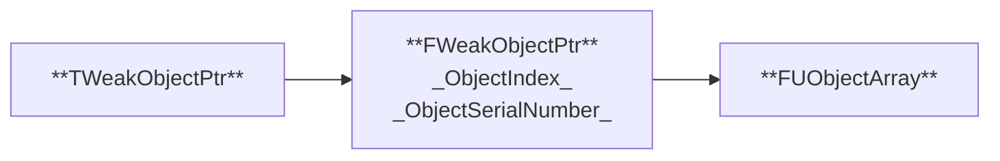

---
{"dg-publish":true,"permalink":"/unreal-engine/smart-pointer/","noteIcon":""}
---

UnrealEngine의 UObject는 MarkAndSweep기반 Garbage Collection을 이용하여 메모리 관리를 처리한다. GC기반에서 작동하는 Smart Pointer 가 있고, UObject가 아닌 Raw Pointer에 사용되는 Smart Pointer가 존재한다.

## Based On GC
---
### TWeakObjectPtr

- GC의 수집 시 Mark 처리하지 않지만 가리키는 Object의 유효성을 판단
- FWeakObjectPtr을 통해 처리
	- int ObjectIndex
	- int ObjectSerialNumber : Object가 Weak Pointer가 생성될 때만 할당
	- 해당 UObject가 GC에 의해서 삭제되면 SerialNumber 값 변경

### TStrongObjectPtr

TStrongObjectPtr 내용 처리

## Raw Pointer
---

TUniquePtr과 TSharedPtr은 [[C++/RAII\|RAII]]기법을 활용하여 메모리 해제를 안전하게 처리한다.
### TUniquePtr

### TSharedPtr

### TWeakPtr

